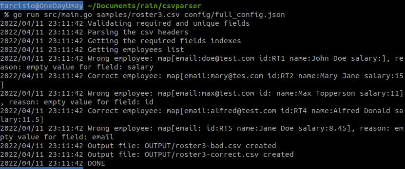
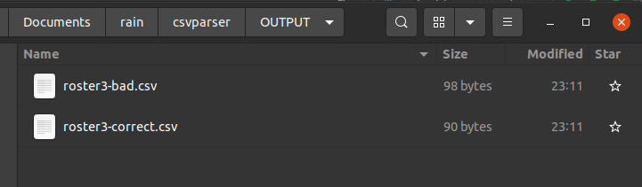
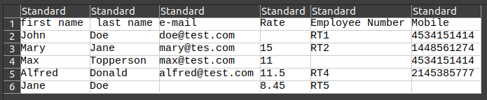
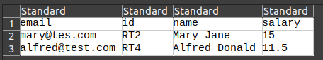
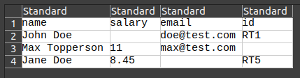

# CSV Parser
Rain CSV Parser challenge

CSV Parser is an CLI app that parses CSV files and outputs two files, one with the correct data and another with bad data.

the project specification can be found in: [Rain_CSV_Parser_v4.docx](Rain_CSV_Parser_v4.docx)
## Run

``go run src/main.go samples/roster1.csv config/full_config.json``

CSV parser loads the csv file as the first parameter and configurations from the second parameter

## Output
logs are outputed in the terminal:



and the output files are inserted into OUTPUT dir:



original CSV file:



correct data csv:



bad data csv:




## Configuration file
for configuring the required fields (values that will be filtered) and unique fields (not duplicated fields)
they must be declared following the below example:

    {
    "RequiredFields": {
        "email": [
        {
            "Name": [
                "email"
            ],
            "MultipleCol": false
        },
        {
            "Name": [
                "e-mail"
            ],
            "MultipleCol": false
        }
        ],
        "id": [
        {
            "Name": [
                "id"
            ],
            "MultipleCol": false
        }],
        "name": [
        {
            "Name": [
                "f.name",
                "l.name"
            ],
            "MultipleCol": true
        },
        {
            "Name": [
                "name"
            ],
            "MultipleCol": false
        }]
    },
    "UniqueFields": [
            "email",
            "id"
        ]
    }
each required field is an key in the "RequiredFields" JSON,
and for each required field, it has an list of possible combinations.
For example, the required field "name", can have "f.name" with "l.name" and "name" 
as possible values in the csv headers, for example

csv: 

    l.name, email, id, f.name
    marinho, tarcisio_marinho09@hotmail.com, 3, tarcisio

the parser would get the required field name as: "tarcisio marinho"

Or if the csv only have one field of name:

csv:
    
    name, id, email
    tarcisio marinho, 3, tarcisio_marinho09@hotmail.com
would also get the name "tarcisio marinho"

As for the unique fields, they are fields that cannot be duplicated.
For example, for the unique fields: ```["email", "id"]```:
    
csv:

    name, id, email
    tarcisio, 3, tarcisio_marinho09@hotmail.com
    joao, 5, joao@hotmail.com
    maria, 6, tarcisio_marinho09@hotmail.com

the csv has a duplicated email ``tarcisio_marinho09@hotmail.com`` 


## Parser

the parser library can be used regardless the input source, 
it can be used in APIs, web apps, CLIs, and so on.


TODOs:
- revisitar todo o código
- implementar os testes unitários
- testar vários cenários e documentos

Tests:

- cenários com headers inválidos, vazios, alguns vazios, todos vazios
- cenários dos campos do csv estarem vazios, inválidos, alguns vazios, etrc
- cenários do input estar invalido, não tiver campos unique, não tiver campos required
- cenários onde o arquivo ou a pasta de saida já existam